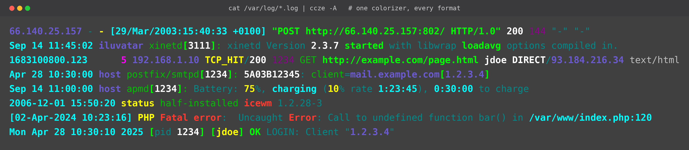
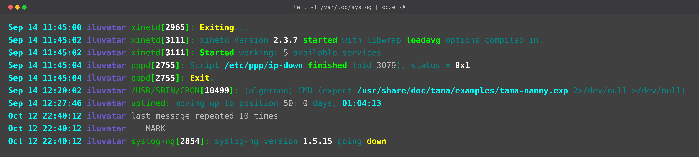
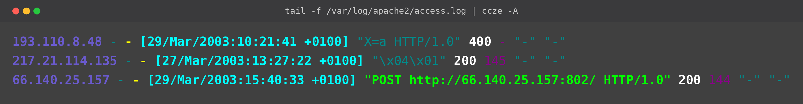
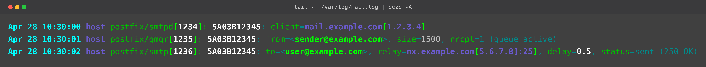
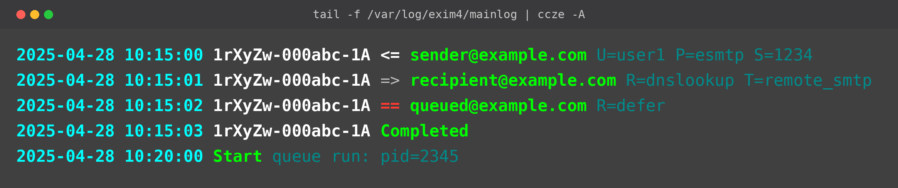
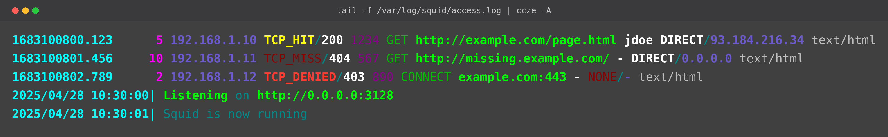
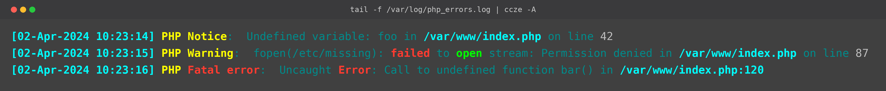
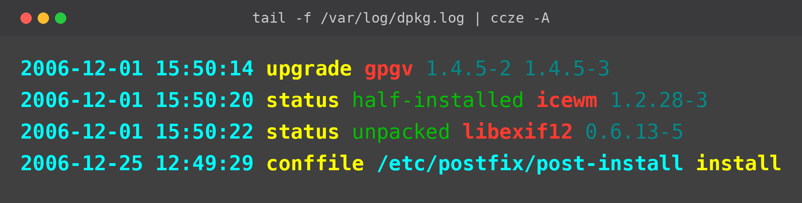
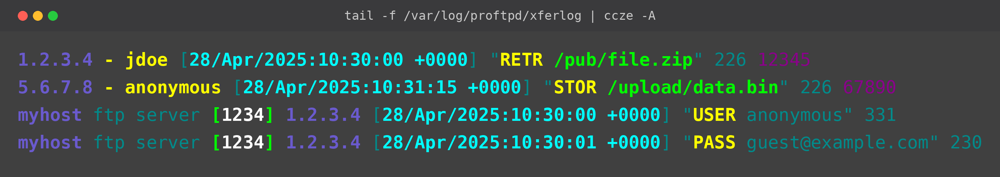
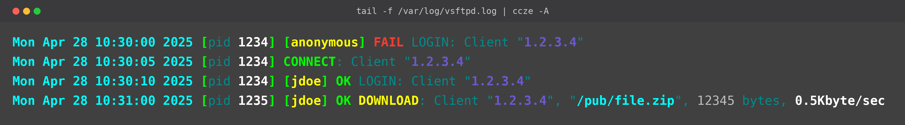

<h1 align="center">ccze — rust port</h1>

<p align="center">
  <strong>One colorizer, every log format.</strong> Pipe any log file through <code>ccze</code> and
  read it the way it was meant to be read — timestamps, hosts, PIDs, IPs, URLs, status codes,
  and errors all lit up by format-aware plugins.
</p>

<p align="center">
  
</p>

<p align="center">
  <code>cat /var/log/*.log | ccze -A</code> — Apache, syslog, squid, Postfix, dpkg, PHP, and more,
  colorized in a single pass.
</p>

<p align="center">
  
  
  
  
  
</p>

---

A Rust port of [ccze](https://github.com/cornet/ccze), the streaming log colorizer. `ccze` reads
log lines on stdin, recognizes them with **format-aware plugins** (syslog, Apache httpd, Postfix,
Exim, squid, ProFTPD, Icecast, Procmail, and 12 others — **20 plugins in total**), and emits
colorized output as ANSI escape codes, a self-contained HTML document, or debug tags. Anything a
plugin doesn't claim falls through a **wordcolor pass** that highlights errors, warnings, and
successes by keyword.

This port is **feature-complete against upstream**: 20/20 plugins, all three output sinks
(ANSI, HTML, debug), `~/.cczerc` parsing with `-c key=color` overrides, and **byte-exact parity**
with the original C binary. TDD-driven from day one — every snapshot test feeds a `.in` fixture
through the binary and byte-compares stdout to a `.ok` reference minted from the C reference
running inside Docker.

## Why ccze?

- **Zero configuration.** Pipe a log in, get color out. No format strings, no per-app setup — the
  right plugin recognizes the line and colors it correctly.
- **Format-aware, not regex-soup.** 20 dedicated plugins understand the *structure* of each log
  type, so a Postfix queue ID, an Apache status code, and a squid cache verdict each get their own
  meaning-carrying color.
- **Built for streaming.** Works cleanly with `tail -f` for live log watching — no alternate
  screen, no cursor games, just colorized lines flowing by.
- **Three ways to render.** Live ANSI for the terminal, a self-contained HTML document (with
  embedded CSS) for sharing or archiving, and debug tags for scripting.
- **Faithful to the original.** Every plugin is a byte-for-byte translation of upstream ccze,
  verified against the real C binary. If upstream colors it a certain way, so does this.
- **A single fast binary.** Rust, statically linked plugins, `--release` LTO build. No runtime,
  no dependencies to install alongside it.

## See it in action

Every screenshot below is real `ccze -A` output. One tool, many formats — notice how each log type
gets colors tuned to *its* structure.

### syslog — daemon messages

Timestamps, hostnames, and PIDs are pulled out of every line; keywords like `started`, `Exit`, and
`down` are highlighted so state changes jump off the screen.



### Apache httpd — access log

Combined-format access lines with IPs, request methods, and HTTP status codes each in their own
color — a `400` reads differently from a `200` at a glance.



### Postfix — mail log

Queue IDs, `client=`, `from=`, `to=`, `relay=`, and `status=sent` are all recognized, so you can
follow one message across `smtpd` → `qmgr` → `smtp` by its queue ID.



### Exim — mail queue

The `<=` / `=>` / `==` arrows, message IDs, addresses, and `Completed` markers are colored to trace
a message through arrival, delivery, deferral, and queue runs.



### squid — proxy cache

Cache verdicts (`TCP_HIT`, `TCP_MISS`, `TCP_DENIED`) and their status codes are color-coded so
hits, misses, and denials are instantly distinguishable.



### PHP — error log

`Notice`, `Warning`, and `Fatal error` escalate in color, and file paths and line numbers are
picked out so you can jump straight to the source.



### dpkg — package log

`upgrade`, `status`, and `conffile` actions plus package names and versions are colored, turning a
wall of install history into a scannable timeline.



### ProFTPD — transfer log

xferlog transfers (`RETR`, `STOR`) with IPs, users, paths, and byte counts, plus FTP command
lines, are colored for quick auditing of uploads and downloads.



### vsftpd — FTP log

Login outcomes (`FAIL` / `OK`), `CONNECT`, and `DOWNLOAD` events with clients, paths, sizes, and
transfer rates — failures stand out in red immediately.



> 📸 **More formats:** see the full [screenshot gallery](docs/gallery.md) for every plugin, side by
> side, with the exact command that produced each one.

## Acknowledgements

Enormous thanks to **[Gergely Nagy (cornet)](https://github.com/cornet)** and the contributors to
the original [ccze](https://github.com/cornet/ccze). Every plugin in this repo is a translation of
their work — the regexes, color semantics, plugin architecture, wordcolor word lists, and several
of the `bug-*` test fixtures (provenance tracked in `testdata/SOURCES.md`) all come straight from
upstream. This port exists only because that codebase existed first; all credit for the design,
taste, and decade-plus of bug fixes belongs there. This project is released under
**GPL-2.0-or-later**, matching the upstream license.

## Status — port complete

Phases 0–11 done. **27/27 snapshot tests + 9/9 unit tests green.**

| Surface | Status |
|---|---|
| Plugins | All 20 ported (`syslog`, `httpd`, `dpkg`, `php`, `super`, `distcc`, `vsftpd`, `sulog`, `ftpstats`, `oops`, `exim`, `xferlog`, `icecast`, `proftpd`, `squid`, `procmail`, `apm`, `fetchmail`, `postfix`, `ulogd`) |
| Wordcolor fallback | Ported with all 13 regex patterns + bad/good/error/system word tables |
| Output sinks | `DebugSink` (`-d`) · `AnsiSink` (`-A`, default on TTY) · `HtmlSink` (`-h`) |
| Curses mode | Dropped. `-m curses` is an alias for ANSI — the C `initscr()` mode owned the alternate screen, which is bad UX for streaming logs |
| `~/.cczerc` | Parsed, plus `-c key=color` overrides on the CLI |
| CLI flags | `-F -p -o -d -A -h -m -l -c -r -V --cssdump` |
| Out of scope | `-a plugin=args` (no plugin uses argv), `-C` unix→date conversion, SIGHUP reload |

## Quickstart

```sh
# Tail a real log file with colors:
tail -F /var/log/system.log | cargo run --release -- -p syslog

# Generate a self-contained HTML log (with embedded CSS):
ccze -h -F /dev/null -p syslog < /var/log/system.log > out.html

# Override the colour for syslog timestamps to red, on the fly:
ccze -A -c date=red < some.log

# Dump just the embedded CSS (e.g. to write a sidecar stylesheet):
ccze --cssdump > ccze.css
```

## Layout

```
rust/
  Cargo.toml
  src/
    main.rs        — CLI entry, stdin loop, mode dispatch
    cli.rs         — clap definitions
    color.rs       — Color enum + AnsiAttr table + CSS palette
    config.rs      — .cczerc parser (also feeds `-c` overrides)
    sink.rs        — OutputSink trait + DebugSink/AnsiSink/HtmlSink + write_css_classes
    plugin.rs      — Plugin trait, PluginType, Pipeline (Full → Partial → wordcolor)
    wordcolor.rs   — fallback word colorizer (ports ccze-wordcolor.c)
    plugins/       — one .rs per plugin; `mod.rs` is the static registry
  tests/
    snapshot.rs    — byte-exact .in/.ok snapshot harness
  testdata/
    bug-*.{in,ok}              — 6 fixtures from the original C testsuite
    snap-<plugin>.{in,ok}      — 16 synthetic fixtures, one per plugin
    snap-ansi-<base>.ok        — ANSI mode references
    snap-html-<base>.ok        — HTML mode reference
    SOURCES.md                 — provenance + Docker image commit pin
  scripts/
    Dockerfile                 — Debian-slim builder for the C reference
    build-c-ref.sh             — wraps `docker build` → `ccze:reference`
    generate-baseline.sh       — pipes `<name>.in` through the reference
    generate-all-baselines.sh  — runs the above for every untested plugin
docs/
  images/                      — the screenshots shown above
  gallery.md                   — full plugin screenshot gallery
```

## Running tests

```sh
cd rust && cargo test         # 36 tests across unit + integration
cd rust && cargo test --release
```

## Adding a plugin (the TDD micro-loop)

1. Write a 5–15 line synthetic `testdata/snap-<plugin>.in`.
2. `rust/scripts/build-c-ref.sh` — one-time, builds the Docker reference image.
3. `rust/scripts/generate-baseline.sh snap-<plugin> <plugin>` — produces
   `snap-<plugin>.ok` from the C reference.
4. Add a `#[test] fn snap_<plugin>()` to `tests/snapshot.rs`.
5. `cargo test --test snapshot snap_<plugin>` — RED.
6. Read `../src/mod_<plugin>.c`. Translate the regex + emit logic into
   `src/plugins/<plugin>.rs` implementing `Plugin`.
7. Register the new struct in `src/plugins/mod.rs`.
8. `cargo test --test snapshot snap_<plugin>` — GREEN. Move to the next.

## C reference (Docker)

The C ccze doesn't build cleanly on macOS — its `argp` shim trips on
modern clang and the binary segfaults at runtime. The Rust port sidesteps both
by running the C reference inside Debian:

```sh
rust/scripts/build-c-ref.sh                    # builds image `ccze:reference`
rust/scripts/generate-baseline.sh <name> <plugins>
rust/scripts/generate-all-baselines.sh         # all 16 untested plugins
```

The image entrypoint is the C `ccze` binary, so the helper scripts just pipe
`<name>.in` to its stdin and capture stdout. Provenance + the C tree's git
HEAD when each `.ok` was minted live in `testdata/SOURCES.md`.

## Plan

The full porting strategy lives at
`/Users/malcolm/.claude/plans/i-want-to-port-glistening-ladybug.md`.
